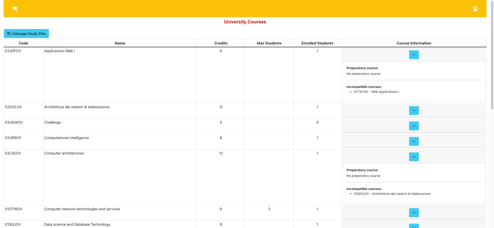
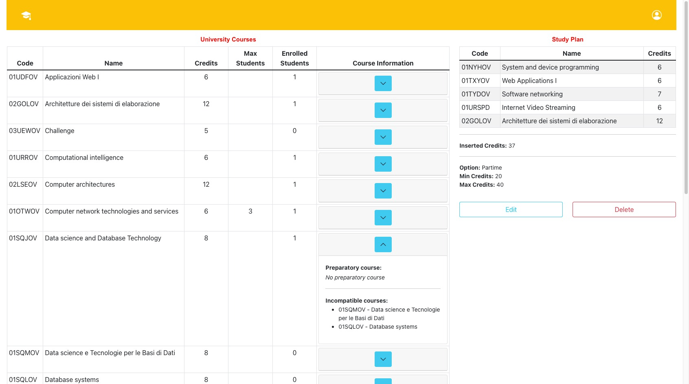
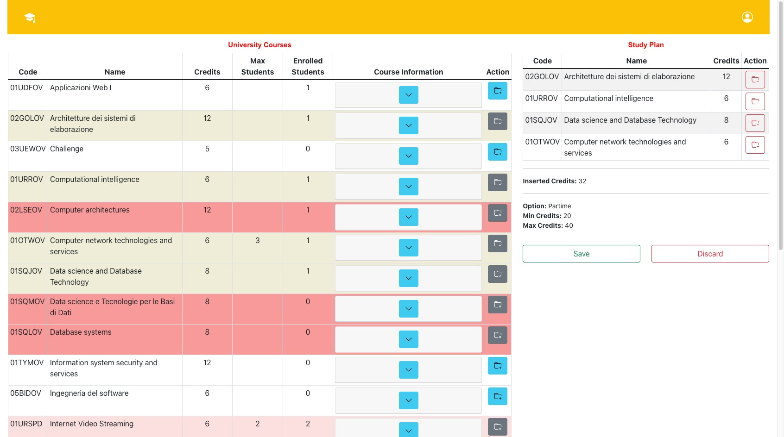
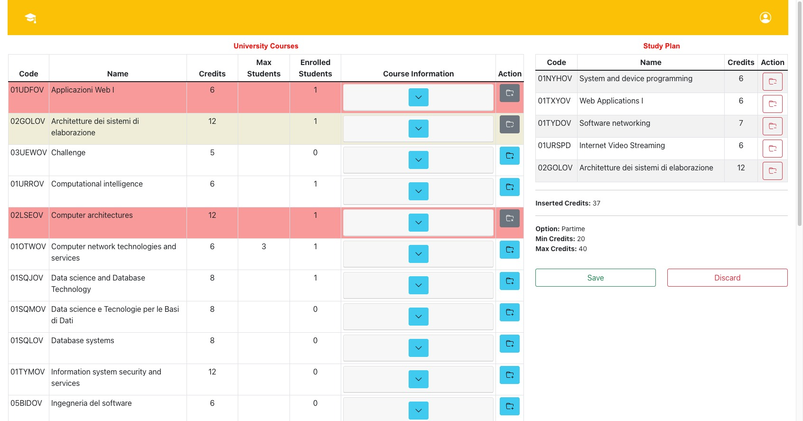
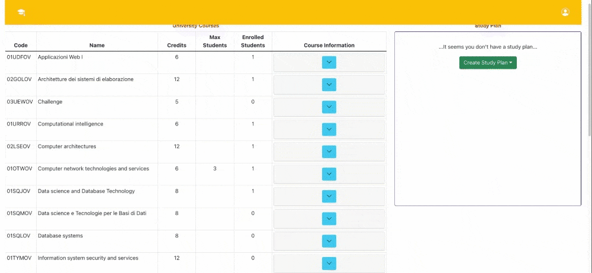

# Exam #1 23/06/2022: "Study Plan"

## Student: s294711 ROSSO MATTIA

## React Client Application Routes

- Route `/`: it contains the HomePage component. It is the route where the user finds himself when not authenticated. All the courses are here displayed.
- Route `/studyPlan`: this is the page where the user finds himself when he is authenticated. Here are displayed a constant component that is the table containing all courses plus an Outlet component that can be either a blank card if the student has not a study plan or the list of courses of his studyplan if he already has one.
- Route `/studyPlan/edit`: this is the route dedicated to editing an already existing studyplan or for creating new one from scratch.
- Route `/login`: page containing the login form.
- Route `*`: used to handle user typing errors in the url. It will display a button to go back to `/`

## API Server

## Athentication APIs

### Create a new session

- **URL**: `/api/sessions`
- **HTTP method**: `POST`
- **Description**: Creates a new session given the credentials
- **Request body**:

```
{
  "username": "mario.rossi@students.university.it",
  "password": "testpassword"
}
```

- **Response**: `200 OK` (success) or `401 Unauthorized` (error).
- **Response body**: None

### Check if user is logged in

- **URL**: `/api/sessions/current`
- **HTTP method**: `GET`
- **Description**: Verify if the given session is still valid and return the info about the logged-in user. A cookie with a valid session id must be provided.
- **Request body**: None
- **Response**: `200 OK` (success) or `401 Unauthorized` (error).
- **Response body**:

```
{
  "username": "mario.rossi@students.university.it",
  "id": "1",
  "partime": 0
  "studyplan": 1
}

or

{
  "error": "Not Authenticated"
}
```

### Logout

- **URL**: `/api/sessions`
- **HTTP method**: `DELETE`
- **Description**: Delete the current session. A cookie with a valid session id must be provided
- **Request body**: None
- **Response**: `204 No Content` (success) or `500 Internal Server Error` (error).
- **Response body**: None

## Courses APIs

### Get all courses

- **URL**: `/api/courses`
- **HTTP method**: `GET`
- **Description**: Get all the courses stored in table COURSES
- **Request body**: None
- **Response**: `200 OK` (success) or `500 Internal Server Error` (error).
- **Response body**:

```
[
  {
    "code": "02GOLOV"
    "name": "Architetture dei sistemi di elaborazione"
    "credits": 12
    "maxStudents": null
    "enrolledStudents": 1
    "preparatoryCourse": null
  },
  {
    "code": "05BIDOV"
    "name": "Ingegneria del software"
    "credits": 6
    "maxStudents": null
    "enrolledStudents": 0
    "preparatoryCourse": "02GOLOV"
  }
  ...
]
```

### Modify the number of enrolled students of a course

- **URL**: `/api/courses/:code`
- **HTTP method**: `PUT`
- **Description**: Increment/decrement the number of enrolled students of the course with code `:code`. The parameter "enroll" in the body is 1 if enrolled students value has to be incremented, 0 if it has to be decremented
- **Request body**:

```
{
  "enroll": 1
}

or

{
  "enroll": 0
}
```

- **Response**: `200 OK` (success) or `500 Internal Server Error` (error) or `401 Unauthorized` (not logged in user) or `422 Unprocessable Entity` (_enroll_ value not valid or code not valid)
- **Response body**: None

### Get all incompatible courses

- **URL**: `/api/courses/incompatibles`
- **HTTP method**: `GET`
- **Description**: Get the list of all incompatible courses as (code, code). It is the content of table INCOMPATIBLES
- **Request body**: None
- **Response**: `200 OK` (success) or `500 Internal Server Error` (error).
- **Response body**:

```
[
 {"course_a": "02GOLOV", "course_b": "02LSEOV"},
 {"course_a": "01SQJOV", "course_b": "01SQMOV"},
 ...
]
```

## Studyplan APIs

### Get courses of a stuyplan

- **URL**: `/api/studyplans/:id`
- **HTTP method**: `GET`
- **Description**: Get the list of all courses of the studyplan of the user with id `:id`
- **Request body**: None
- **Response**: `200 OK` (success) or `500 Internal Server Error` (error) or `401 Unauthorized` (not logged in user) or `422 Unprocessable Entity` (not valid id)
- **Response body**:

```
[
  { "code": "02GOLOV"
    "name": "Architetture dei sistemi di elaborazione"
    "credits": 12
    "maxStudents": null
    "enrolledStudents": 1
    "preparatoryCourse": null
  },
  {
    "code": "03UEWOV"
    "name": "Challenge"
    "credits": 5
    "maxStudents": null
    "enrolledStudents": 1
    "preparatoryCourse": null
  },
  ...
]

```

### Create a new studyplan

- **URL**: `/api/studyplans/:id`
- **HTTP method**: `POST`
- **Description**: Create a new studyplan for user with id `:id`
- **Request body**:

```
{
  "courses": ["02GOLOV", "03UEWOV", ...],
  "partime": 1
}
```

- **Response**: `200 OK` (success) or `500 Internal Server Error` (error) or `422 Unprocessable Entity` (not valid id or body or study plan doesn't satisfy the constraints) or `401 Unauthorized` (not logged in user).
- **Response body**: None

### Delete an existing studyplan

- **URL**: `/api/studyplans/:id`
- **HTTP method**: `DELETE`
- **Description**: Permanently delete the studyplan of the user with id `:id`
- **Request body**: None
- **Response**: `204 No Content` (success) or `500 Internal Server Error` (error) or `422 Unprocessable Entity` (not valid id) or `401 Unauthorized` (not logged in user).
- **Response body**: None

## Students APIs

### Modify user information

- **URL**: `/api/students/:id`
- **HTTP method**: `PUT`
- **Description**: Modify 'partime' and 'studyplan' properties of the user with id `:id`.The 'studyplan' property is 1 if the user has a studyplan, 0 otherwise. The 'partime' property is 0 if the studyplan is fulltime, 1 if it is partime. (In table STUDENTS the partime column is considered only if studyplan is 1, otherwise it contains an unconsistent information)
- Request body:

```
{
  "partime": 0
  "studyplan": 1
}
```

- **Response**: `200 OK` (success) or `500 Internal Server Error` (error) or `422 Unprocessable Entity` (not valid id or not valid values in body) or `401 Unauthorized` (not logged in user).
- **Response body**: None

---

## Database Tables

- **COURSES**(<u>CODE</u>, NAME, CREDITS, MAXSTUDENTS, ENROLLEDSTUDENTS, PREPARATORYCOURSE)
- **INCOMPATIBLES**(<u>COURSE_A</u>, <u>COURSE_B</u>)
  - Both COURSE_A and COURSE_B reference COURSES(CODE)
- **STUDENTS**(<u>ID</u>, EMAIL, PASSWORDHASH, PASSWORDSALT, PARTIME, STUDYPLAN)
  - Each student is characterized by an id assigned with autoincrement
  - If the STUDYPLAN attribute is 1 PARTIME attribute has to be considered (1: partime, 0: fulltime); otherwise it contains an unconsistent information
- **STUDYPLANS**(<u>STUDENT</u>, <u>COURSE</u>)
  - STUDENT references STUDENTS(ID), COURSE references COURSES(CODE)

---

## Main React Components

All the files belonging to the `/src` folder of the React application are organized as follows:

- `/src/API`: folder containing one file for each class of APIs that are students, courses, studyplans
- `/src/Models`: folder containing one file for each class so, again, student, course and studyplan
- `/src/Layouts`: this folder contains files used to define all the elements beloning to a specific layout. Following what i have done with the routes i have defined three main layouts where i have placed all my componenents that are HomePage, LoginForm, StudyPlanPage. A Layout is the entrypoint of a route
- `/src/Componenents`: this folder contains all the main frontend logic. Each file contains one or more elements (the elements that are strictly related are placed in the same file). All these elements are used by the Layouts and by other components.
- `/src/App.js`: in file `App.js` there are all the algorithmic functions that both invoke APIs and compute local results needed by the different components. Here also all the routes are defined

### Layout components

- **HomePage**

  - _Path_: `/Layouts/HomePage.js`
  - _Description_: This is the layout showed when the user is in `/` route (so he is not logged in). Here three components are showed:
    - **NavigationBar**
    - **ButtonMessageStudyPlan**: the blue button on top that redirects the user to the login form
    - **FullCoursesTable** / **Spinner**: here, before data are fetched from database, a circular spinner appears in the center of the page. Otherwise the table with all courses is displayed

- **LoginForm**

  - _Path_: `/Layouts/LoginForm.js`
  - _Description_: this is the layout displayed when the user is going to login inside `/login` route. Here the login API is fetched when the user clicks on Login button. In case of not correct username/password it is showed a message. If credentials are correct the user is redirected on `/studyPlan` route

- **StudyPlanPage**
  - _Path_: `/Layouts/StudyPlanPage.js`
  - _Description_: This layout always shows the full courses table on the left while on the right there is an Outlet component that shows either:
    - index route: route with element `StudyPlanTableLayout` or `StudyPlanEmptyLayout`
    - `/studyPlan/edit` route with element StudyPlanTableLayout
  - _Sub-Layouts_:
    - **StudyPlanEmptyLayout**: this is what the logged user sees on the right of the `/studyPlan` page if he has not a studyplan saved in the database. It is a square card with a dropdown button that allows the user to create a new study plan going to the route `/studyPlan/edit` choosing if the studyplan will be either partime or full time
    - **StudyPlanTableLayout**: it is a wrapper for the element `StudyPlanTable`
- **NotFoundLayout**
  - _Path_: `/Layouts/NotFoundLayout.js`
  - _Description_: This layout is displayed if the url doesn't match any of the above routes

---

### Navigation bar

- _Path_: `/Componenents/NavigationBar.js`
- _Description_: This is the top yellow navigation bar where 2 elements are displayed: both an icon on the left that navigates to the homepage and a login button on the right that allows to either navigate to the login page or to open a right sidebar that displays information of the current logged user
- _Sub-Components_: `UserButtonCanvas` is the right sidebar that is opened when the logged in user clicks on user icon in upper right corner. This components is a Offcanvas showing information about username, studyplan, partime

### FullCoursesTable

- _Path_: `/Components/FullCoursesTable.js`
- _Description_: this is for sure the component with the hight complexity in term of functionalites provided. Firstly, this table can be either visualized by a not logged in user or by a logged in user. This table can be visualized in three different routes:
  - `/` route (non-logged user): this is the only component of the HomePage and simply displays expandible information about each course
  - `/studyPlan` route (logged user): the table is displaying exaclty the same information of the non-logged in homepage but occupies only 3/4 of the available space
  - `/studyPlan/edit` route (logged user): The table is displayed with an additional column for putting the AddButton plus the possibility of changing the background color of the rows depending on some conditions that are textually explained by hovering with mouse over the add button
- _Sub-Components_:
  - **CourseTableRow**: handles all the information that need to be displayed and also the background color
    - **AccordionBox**:
      - _Path_: `/Components/AccordionBox.js`
      - _Description_: this is the expandible accordion showed in all the possible views of the table. Here information about not compatibles and preparatory courses are displayed
    - **AddCourseButton**:
      - _Path_: `/Components/AddCourseButton.js`
      - _Description_: This is the button used to add a course to the studyplan when the user is in `studyPlan/edit`. The button can be enabled/disabled depending on which are the courses currently present in the studyplan. In case of button disabled the correspondent row is colored in red in case that course in not compatible with 1+ courses in the studyplan, light yellow if the course has been already added to study plan, light red if it has reached the maximum number of enrolled students. A functionality i have added is a popup appearing when clicking on the button that asks the user if, trying to adding course A that has B as preparatory course (and B is not present in studyplan), he wants to directly add them both or not.
      - _Sub-components_: `AddCourseButtonNoOverlay`, `AddCourseButtonOverlay`

### StudyPlanTable

- _Path_: `/Components/StudyPlanTable.js`
- _Description_: This is the table that shows the courses of the studyplan of the logged user (if he already has one) or the 'local' version of studyplan if he is editing/creating it. Like for FullCoursesTable the appearence depends on the route:
  - `/studyPlan` route: here only if the student has already a studyplan the table will be displayed otherwise there will be a card on the right with a button giving the user the possibility of creating a new study plan
  - `/studyPlan/edit` route: here the table can be empty/filled with courses of already existing study plan. In both cases a new column with a 'remove button' is added to allow the user to remove a course from the studyplan. Here is where the core part of the application is fully working. When adding/removing course the total number of credits is displayed on the bottom also showing the min/max values according to the type of selected study plan (partime/fulltime).
- _Sub-Components_:
  - **CourseTableRow**: Each row of the studyplan table is very similar to a row of the full courses table. The differences are that there is no the accordion and the button on the right is used to remove a course from the studyplan. Here i have added the possibility of, when deletning a course B that is preparatoy for a course A (that is in the studyplan), to choose of deleting both the courses from the studyplan. These two subcomponents are used for that:
    - _Sub-Components_: `DeleteButtonOverlayPreparatory`, `DeleteButtonNoOverlay`
  - **SaveDiscardButtons**:
    - _Path_: `/Components/SaveDiscardButtons.js`
    - _Description_: this compoenent implements the buttons that are displayed when the user is in `/studyPlan/edit`. The 'Save' button is active (green color) only if the number of credits currently present in the study plan is above the minimum and lower than maximum. Otherwise the button is disabled. The 'Discard' button is used to undo the edit/create operation. When clicking it the user will find himself on `/studyPlan` route either visualizing the table of the study plan if he had one or the empty card with option for creating new one
  - **EditDeleteButtons**:
    - _Path_: `/Components/EditDeleteButtons.js`
    - _Description_: this componenens implements the buttons that are displayed when the user is in `/studyPlan` route and he already has a study plan. If he goes for the option 'Delete' it means that the studyplan will be permanently deleted from the database

---

## Screenshots

## HomePage


## Show Study Plan


## Create new study plan


## Edit study plan



---

## Demo

## Create new study plan


## Edit study plan


## Users Credentials

| id  |            username(email)            |   password   |
| :-: | :-----------------------------------: | :----------: |
|  1  |  luca.gialli@students.university.it   | testpassword |
|  2  |  mario.rossi@students.university.it   | testpassword |
|  3  | franco.bianchi@students.university.it | testpassword |
|  4  |  chiara.verdi@students.university.it  | testpassword |
|  5  | nicole.hebert@students.university.it  | testpassword |

---

## Pre-loaded studyplans

### User: mario.rossi@students.university.it

|  code   |                   name                   | credits |
| :-----: | :--------------------------------------: | :-----: |
| 01NYHOV |      System and device programming       |    6    |
| 01TXYOV |            Web Applications I            |    6    |
| 01TYDOV |           Software networking            |    7    |
| 01URSPD |         Internet Video Streaming         |    6    |
| 02GOLOV | Architetture dei sistemi di elaborazione |   12    |

Studyplan option: partime

### User: chiara.verdi@students.university.it

|  code   |                    name                    | credits |
| :-----: | :----------------------------------------: | :-----: |
| 01NYHOV |       System and device programming        |    6    |
| 01OTWOV | Computer network technologies and services |    6    |
| 01TXYOV |             Web Applications I             |    6    |
| 01TYDOV |            Software networking             |    7    |

Studyplan option: partime

### User: franco.bianchi@students.university.it

|  code   |                 name                 | credits |
| :-----: | :----------------------------------: | :-----: |
| 01NYHOV |    System and device programming     |    6    |
| 01SQJOV | Data science and Database Technology |    8    |
| 01UDFOV |          Applicazioni Web I          |    6    |
| 01UDUOV |  Sicurezza dei sistemi informativi   |   12    |
| 01URROV |      Computational intelligence      |    6    |
| 01URSPD |       Internet Video Streaming       |    6    |
| 02KPNOV |     Tecnologie e servizi di rete     |    6    |
| 02LSEOV |        Computer architectures        |   12    |
| 04GSPOV |         Software engineering         |    6    |

Studyplan option: fulltime

## Courses with no availability

|  code   |             name              | max students | enrolled students |
| :-----: | :---------------------------: | :----------: | :---------------: |
| 01NYHOV | System and device programming |      3       |         3         |
| 01URSPD |   Internet Video Streaming    |      2       |         2         |
